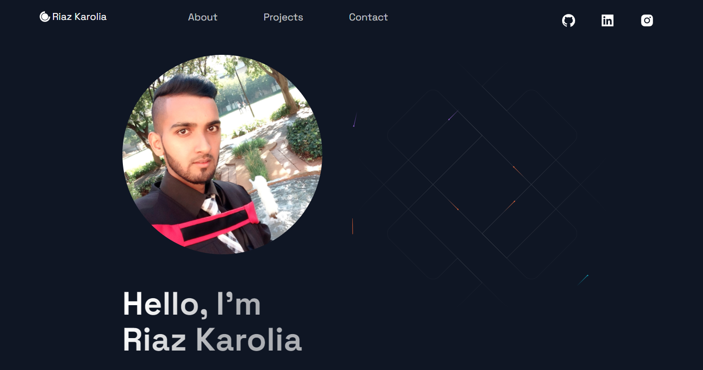
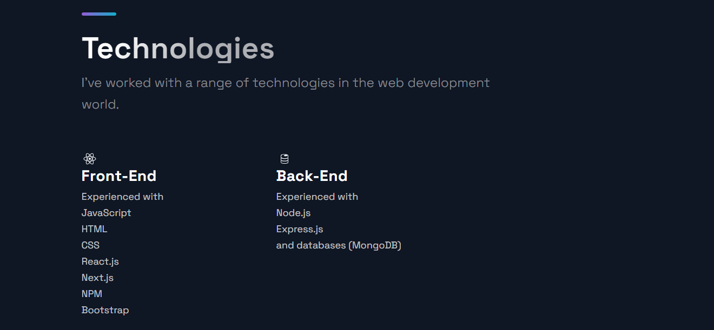
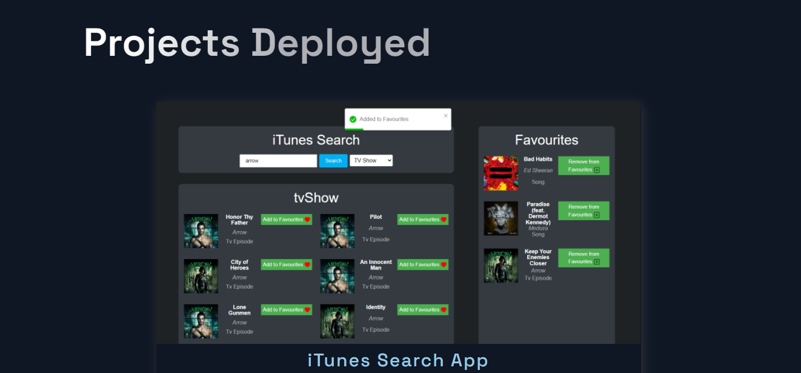
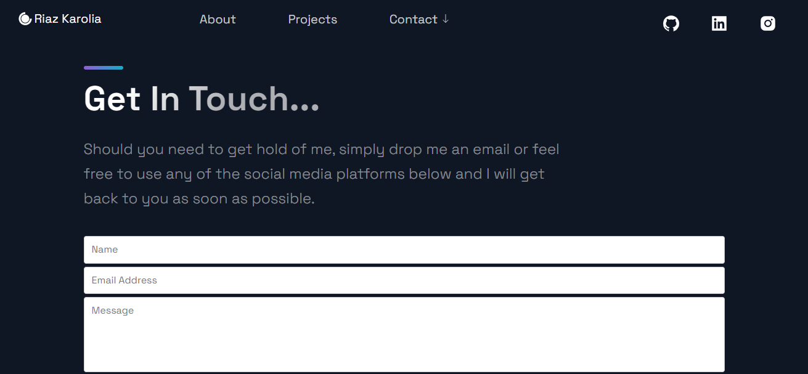

# My Developer Profile

> A Developer Portfolio created using Next JS.

The deployed app can be found [here](https://www.riazkarolia.co.za/)

## Table of Contents:

- [General Info](#general-information)
- [Installation](#installation)
- [Deployment](#deployment)
- [Screenshots](#screenshots)
- [Credits](#credits)
- [Contact](#contact)

## General Information

This is a responsive personal development portfolio which I built and customised using React, Next JS and Styled components.

## Installation

1. On GitHub, navigate to the main page of the repository. Click on the green button "Code". A dropdown menu will be displayed with an option to "Download Zip" - by clicking on this, a zip folder of the app will be downloaded to your pc.

2. In order to work with the zip files, they must be extracted first.
   Navigate to the downloaded folder and right-click on it.

3. Choose "Extract files".

4. The system will tell you where it is going to send the file and you can change that to where you want to send it.

5. Thereafter, drag the folder to a code editor of your choice. In this example, I will make reference to the VS Code editor.

6. Once VS Code has opened up, click on the view tab on the navigation panel and then click on 'terminal' - This will in turn open up the terminal in VS Code.

7. Use 'cd' to navigate to the project folder. eg cd Next.js-Developer-Profile-master

8. Install the nodules folder (node dependencies) by entering 'npm install' into the terminal.

9. Once the node dependencies have been installed, you may enter 'npm run dev' into the terminal - this will run the app in development mode.
   Open [http://localhost:3000](http://localhost:3000) to view the app within the browser.

10. The Next JS App will now run on your local machine.

## Deployment

I deployed my Developer Profile on [Vercel](https://www.riazkarolia.co.za/ "Developer Profle") with my very own custom domain which was purchased from [Domains.co.za](https://www.domains.co.za/)

Firstly, I pushed my application to a GitHub repository and thereafter I deployed it to Vercel using the GitHub integration.

This approach saved me a lot of time because each push that I made to the GitHub repository was automatically detected by Vercel and correspondingly a new build of the app was initiated and deployed with the changes.

## Screenshots

## Credits

- Build and Deploy THE PERFECT Portfolio Website - by [JavaScript Mastery](https://www.youtube.com/watch?v=OPaLnMw2i_0)
- HyperionDev - https://www.hyperiondev.com/

## Contact

👤 **Riaz Karolia**

Feel free to contact me on [LinkedIn](https://www.linkedin.com/in/riaz-karolia/)